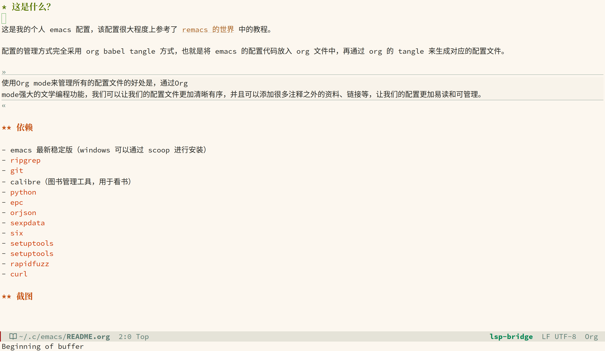

* 这是什么？

这是我的个人 emacs 配置，该配置很大程度上参考了 [[https://remacs.fun/][remacs 的世界]] 中的教程。

配置的管理方式完全采用 org babel tangle 方式，也就是将 emacs 的配置代码放入 org 文件中，再通过 org 的 tangle 来生成对应的配置文件。

#+begin_quote
使用Org mode来管理所有的配置文件的好处是，通过Org mode强大的文学编程功能，我们可以让我们的配置文件更加清晰有序，并且可以添加很多注释之外的资料、链接等，让我们的配置更加易读和可管理。
#+end_quote

** 依赖

- emacs 最新稳定版（windows 可以通过 scoop 进行安装）
- ~ripgrep~
- ~git~
- calibre（图书管理工具，用于看书）
- ~python~
- ~epc~
- ~orjson~
- ~sexpdata~
- ~six~
- ~setuptools~
- ~setuptools~
- ~rapidfuzz~
- ~curl~

** 截图

  
